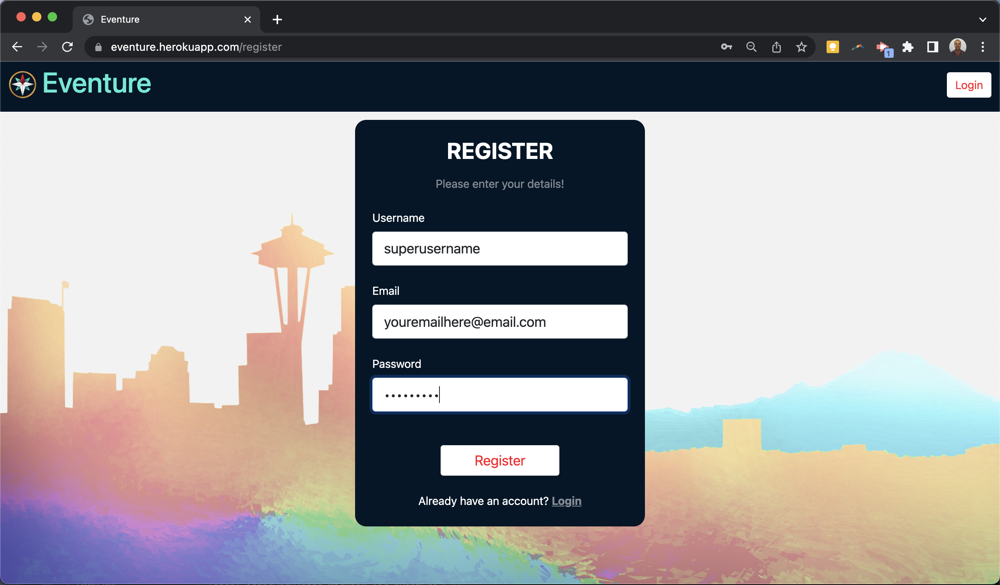

# Eventure

## Description
Eventure is a dynamic Seattle-based event planning and discovery website, designed to ignite your passion for exploration and adventure. With a curated selection of local happenings, it seamlessly connects you to captivating experiences. Whether you seek concerts, social gatherings, or art exhibitions, Eventure guides you towards memorable encounters, making your journey truly unforgettable.

## Table of Contents
- [Usage](#usage)
- [Credits](#credits)
- [Features](#features)
- [Access](#access)

## Usage
- To use the site you will need to go to the [Eventure registration page and sign-up](https://eventure.herokuapp.com/register)
- You can then explore the various events in your area by topic
- If you want to join, you click the sign-up button
- You will be notified of via email a confirmation!
- If plans change, you can always "Drop Event"
- You can create your own event and get others to join you

## Video Demo Link
https://drive.google.com/file/d/191xIH6JHY_l3xdmr7V9RSJ6Z-oLxmGKK/view

## Credits
This was a group effort of [@johnpow](https://github.com/johnpow), [@Arbitrary_Stag](https://github.com/Arbitrary-Stag), and [@saritha2708](https://github.com/saritha2708).

All Original Artwork by [@Arbitrary_Stag](https://github.com/Arbitrary-Stag).

## Features
- Secure User Registration / Login
- Browse events by topic in your area
- Sign up for events you're interested in
- Receive confirmation email notifications
- Easily cancel participation with "Drop Event" option
- Organize and invite others to your own events

## Access
[Click to View Repository](https://github.com/johnpow/eventure)

[Click for the Live Project](https://eventure.herokuapp.com/)
